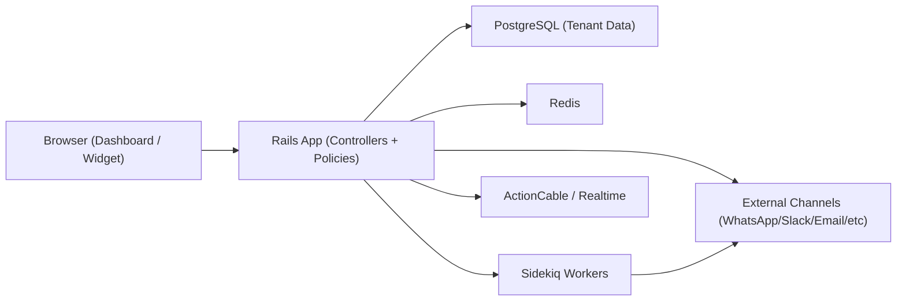

# Chatwoot 架构深度分析（迁移前 As-Is）

- 版本：v1.0
- 日期：2026-02-12
- 目标：为 Java + React 重构提供完整系统解剖与代码证据

## 1. 范围与证据

### 1.1 代码范围
- 前端路由文件：`/Users/wangqi/git/wangqi/chatwoot-wq/.codex/migration/frontend-route-files.txt`（33 个）
- 后端控制器：`/Users/wangqi/git/wangqi/chatwoot-wq/.codex/migration/backend-controller-files.txt`（197 个）
- 模型：`/Users/wangqi/git/wangqi/chatwoot-wq/.codex/migration/model-files.txt`（151 个）
- 服务：`/Users/wangqi/git/wangqi/chatwoot-wq/.codex/migration/service-files.txt`（238 个）
- Rails 路由：`/Users/wangqi/git/wangqi/chatwoot-wq/.codex/migration/backend-routes-clean.txt`（701 条）

### 1.2 运行态证据
- 本地 Docker 实例：`http://localhost:38080`
- 实机截图索引：`/Users/wangqi/git/wangqi/chatwoot-wq/.codex/migration/07-screenshot-index.md`
- 功能-代码-截图主文档：`/Users/wangqi/git/wangqi/chatwoot-wq/.codex/migration/02-granular-feature-catalog.md`

## 2. 系统拓扑

## 3. 前端架构（现状）

### 3.1 模块划分
- `v3/views`：登录、注册、密码重置、SSO 等入口页面
- `dashboard/routes/dashboard/*`：坐席主工作台
- `dashboard/modules/search`：全局搜索
- `widget/*`：访客端小组件

### 3.2 路由组织方式
- 以模块路由文件拆分（例如 `conversation.routes.js`, `reports.routes.js`, `inbox.routes.js`）
- 依赖 `name` + `path` + `meta.permissions` 控制可见性与鉴权
- 以账户作用域 `accounts/:accountId` 作为主要 URL 前缀

### 3.3 前端复杂点
- 同一功能存在 OSS/EE 条件分支（部分页面可能回退）
- 页面级状态依赖后端权限、订阅状态、额度状态（enterprise limits）
- 对实时事件与后台任务结果有强依赖（消息、通知、状态变更）

## 4. 后端架构（现状）

### 4.1 API 域与路由统计
来自 `/Users/wangqi/git/wangqi/chatwoot-wq/.codex/migration/backend-route-stats.md`：
- `api/v1/accounts/*`: 399
- `api/v2/accounts/*`: 20
- `platform/api/v1/*`: 23
- `public/api/v1/*`: 25
- `super_admin/*`: 74
- `/app/*` 前端入口映射：21

### 4.2 控制器层组织
- 业务控制器：`app/controllers/api/v1/accounts/*`
- 报表控制器：`app/controllers/api/v2/accounts/*`
- 平台 API：`app/controllers/platform/api/v1/*`
- 公共 API：`app/controllers/public/api/v1/*`
- 企业增强：`enterprise/app/controllers/api/v1/accounts/*`
- 超管：`app/controllers/super_admin/*`

### 4.3 关键跨域能力
- 多租户账户隔离：`Account` 为全链路上下文
- 权限与策略：Policy + 角色体系 + EE 自定义角色
- 实时广播：ActionCable + dispatcher 事件流
- 异步任务：Sidekiq 队列（通知、同步、回调、AI任务等）
- 集成回调：webhook + OAuth + 第三方 API

## 5. 数据模型与领域边界

### 5.1 核心聚合
- `Account`: 租户根
- `User`, `AccountUser`: 人员与租户关系
- `Inbox`: 渠道/收件箱实体
- `Conversation`, `Message`: 核心会话流
- `Contact`, `ContactInbox`: 外部联系人体系
- `AutomationRule`, `Macro`, `CannedResponse`: 自动化层
- `Campaign`: 主动触达层
- `Portal`, `Category`, `Article`: Help Center

### 5.2 领域建议（迁移时）
- Conversation Domain
- Contact/CRM Domain
- Channel/Inbox Domain
- Automation Domain
- Reporting Domain
- Identity & Access Domain
- Admin/Platform Domain
- Enterprise Add-ons Domain

## 6. 运行与部署

### 6.1 当前验证环境
- 编排：`/Users/wangqi/git/wangqi/chatwoot-wq/.codex/migration/docker-chatwoot-official.yml`
- 服务：`web`, `sidekiq`, `postgres`, `redis`
- 环境变量：`/Users/wangqi/git/wangqi/chatwoot-wq/.codex/migration/.env.chatwoot-demo`

### 6.2 依赖基线
- Ruby: `3.4.4`（`.ruby-version`）
- Rails: `~> 7.1`
- Sidekiq: `>= 7.3.1`
- Node: `24.x`
- pnpm: `10.x`

## 7. Enterprise Overlay 机制

### 7.1 现状
- Enterprise 代码位于 `enterprise/`，通过同名控制器/模型/服务扩展主流程
- 典型增强域：Captain、Custom Roles、Audit Logs、Applied SLA、Billing

### 7.2 迁移要求
- Java 侧必须显式预留扩展点（Feature Flag + Module Hook）
- 禁止把 EE 逻辑硬编码到 OSS 主链路

## 8. 迁移风险清单（架构级）

1. 账户作用域遗漏导致跨租户数据泄露
2. 会话状态机迁移不完整导致前端行为偏差
3. 实时事件缺失导致 UI 不一致（消息/通知）
4. Sidekiq 任务语义迁移不完整导致异步链路断裂
5. 渠道回调签名校验/重放策略缺失
6. EE 扩展点未抽象导致后续功能无法复用

## 9. 结论

- 当前系统是典型“多租户 + 实时会话 + 多渠道集成 + 企业增量”的中大型业务系统。
- 重构不应按“页面重写”推进，而应按“领域能力 + API 合约 + 事件流”推进。
- 迁移的核心成功标准：保持 `02-granular-feature-catalog.md` 中功能条目的行为一致性。
