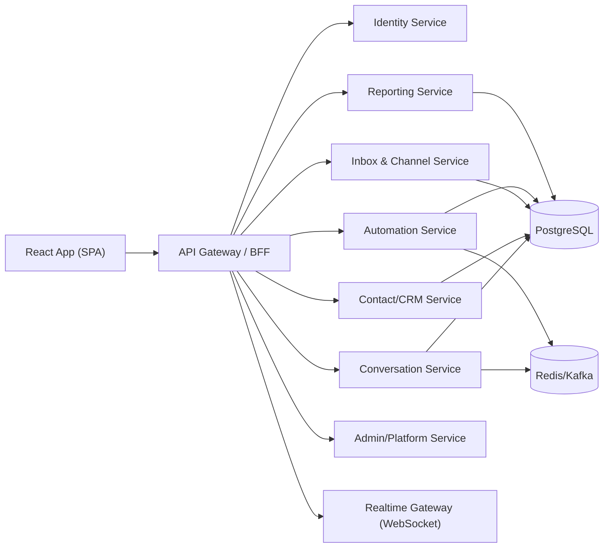

# Java + React 目标架构设计（To-Be）

- 版本：v1.0
- 日期：2026-02-12
- 目标：定义重构后系统形态与渐进迁移策略

## 1. 设计原则

1. 兼容优先：先保持功能行为与 API 契约，再做内部重构。
2. 分域拆分：按业务域拆后端模块，避免“巨型单体控制器”。
3. 扩展优先：OSS 与 Enterprise 从一开始就有可插拔边界。
4. 可观测优先：所有关键链路可追踪、可告警、可回放。

## 2. 目标总体架构

## 3. 技术选型建议

### 3.1 后端（Java）
- 框架：Spring Boot 3.x
- ORM：MyBatis-Plus 或 JPA（建议按领域统一）
- 鉴权：Spring Security + JWT + Refresh Token
- 异步：Spring Scheduler + MQ（或先 Redis Stream）
- 实时：WebSocket + STOMP（或 Socket.IO 网关）

### 3.2 前端（React）
- 框架：React + TypeScript
- 路由：React Router
- 数据层：TanStack Query + Zustand/Redux Toolkit
- UI：结合现有设计 token，先功能一致后视觉升级

## 4. 领域拆分（后端模块）

1. `identity-domain`
- 用户认证、账号上下文、MFA、角色权限

2. `conversation-domain`
- 会话列表、消息、状态流、分配、标签

3. `contact-domain`
- 联系人、备注、属性、关系映射

4. `inbox-channel-domain`
- 收件箱、渠道配置、回调入口

5. `automation-domain`
- 规则引擎、宏、快捷回复、机器人

6. `report-domain`
- 统计聚合、报表导出、实时指标

7. `admin-platform-domain`
- 超管、平台 API、实例配置

8. `enterprise-addon-domain`
- Captain、Audit、Custom Roles、Billing、SLA

## 5. API 兼容策略

### 5.1 兼容级别
- L1：URL/Method 兼容
- L2：请求/响应字段兼容
- L3：错误码与错误语义兼容

### 5.2 执行策略
- 为 `/api/v1` 与 `/api/v2` 建兼容层
- 新服务内部可用新 DTO；对外通过 Adapter 映射为旧协议
- 每个 endpoint 配回归样本（请求+响应快照）

## 6. 数据迁移策略

1. 先镜像现有表结构，完成只读验证。
2. 增量双写：关键实体（Conversation/Message/Contact）先双写再切换读。
3. 按领域切流：Conversation -> CRM -> Automation -> Reports。
4. 保留回滚开关：每个领域独立可回退。

## 7. 实时与异步迁移

### 7.1 实时
- 保持事件语义：`message.created`, `conversation.updated`, `notification.created`
- 统一事件总线 contract（topic + payload schema + version）

### 7.2 异步
- Sidekiq 作业映射到 Java Job 类型
- 迁移时建立“作业对照表”（旧任务名 -> 新任务名 -> 重试策略）

## 8. OSS / Enterprise 分层设计

- `core` 只放 OSS 通用能力
- `enterprise` 通过模块化注入扩展：
  - Controller Advice
  - Policy Provider
  - Feature Registry
  - UI Route Guard

## 9. 非功能要求（NFR）

1. 安全：租户隔离、审计日志、敏感字段脱敏
2. 性能：会话列表 P95 < 500ms
3. 可用性：核心 API 可用性 > 99.9%
4. 可观测：链路追踪覆盖率 100%（关键交易）
5. 可迁移：每个领域提供一键回退开关

## 10. 交付物清单

- 领域 API 合约文档
- 数据迁移脚本与校验报告
- 事件协议文档
- 回归测试套件（接口 + 页面）
- 生产切换 Runbook
